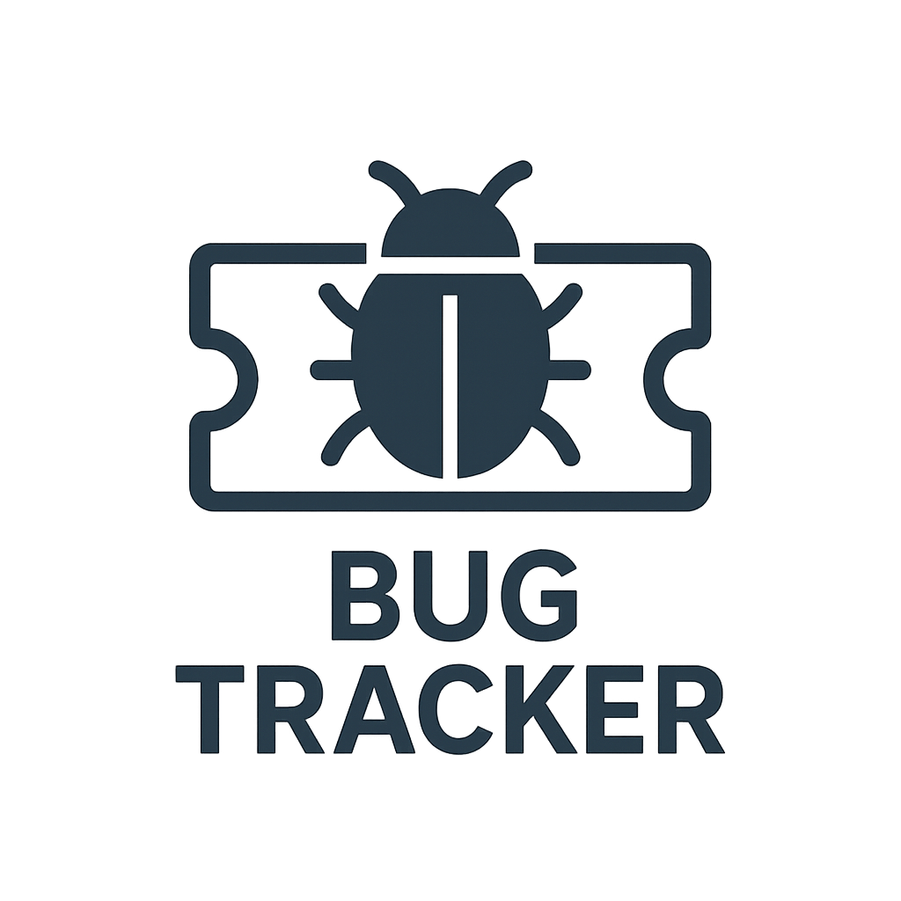

Système de Gestion de Ticket

    

# Description

API développée avec **Django REST Framework (DRF)** pour gérer les tickets, les commentaires et les fichiers joints.
Elle inclut l’authentification par token et une documentation Swagger/OpenAPI.

# Fonctionnalités
    - Authentification sécurisée des utilisateurs par Token
    - Gestion des tickets (création, consultation, modification, suppression)
    - Gestion des commentaires associés aux tickets
    - Gestion des fichiers joints (attachments)
    - Documentation interactive avec **Swagger** et **Redoc**
    - Pagination et filtrage des tickets

# Technologies

    - Back-end :
        - Django
        - Django REST Framework
    
    - Base de Données :
        - PostgreSQL

<!-- 
    - **Django 5.x**
    - **Django REST Framework**
    - **drf-spectacular** (Swagger / OpenAPI 3)
    - **django-filter** pour le filtrage
    - **SQLite** (base de données par défaut, peut être remplacée par PostgreSQL)
    - **django-extensions** (optionnel pour les commandes supplémentaires) 
-->

# Prérequis
Python (v3.10 ou supérieur)

# Installation
Dans votre ligne de commandes, exécutez successivement les actions suivantes:
<ol>
<li>
<h4>Cloner le dépôt</h4>

<code>git clone https://github.com/AbdelFadel06/gestionTicket.git</code>

<code>cd gestionTicket</code>

</li>
<li>
<h4>Créer un environnement virtuel</h4>

<code>python -m venv venv</code>

</li>
<li>
<h4>Activer votre environnement virtuel</h4>

<code>source venv/bin/activate</code> (sous Linux / Mac os)

<code>source venv\Scripts\activate</code> (sous Windows)

</li>
<li>
<h4>Installer les dépendances</h4>

<code>pip install -r requirements.txt</code>

</li>
<li>
<h4>Configurez vos variables d'environnement</h4>

Créez un fichier .env à la racine de votre projet avec les variables suivantes: 

<code><i>SECRET_KEY=votre_clé_secrète</i></code>

<code><i>DEBUG</i></code>

<code><i>DB_NAME</i></code>

<code><i>DB_USER</i></code>

<code><i>DB_PASSWORD</i></code>

<code><i>DB_HOST</i></code>

<code><i>DB_PORT</i></code>

</li>
<li>
<h4>Exécutez les migrations et créez un super-utilisateur</h4>

<code>python manage.py makemigrations</code>

<code>python manage.py migrate</code>

<code>python manage.py createsuperuser</code>

</li>
<li>
<h4>Démarrer le serveur de développement</h4>

<code>python manage.py runserver</code>

</li>
</ol>

# Utilisation

**Authentification**

    POST /api/auth/register/developer/ → Créer un compte développeur
    POST /api/auth/register/ → Créer un compte utilisateur
    POST /api/auth/login/ → S'authentifier
    POST /api/auth/token/refresh/ → Rafraîchir son token (obtenir un nouveau token si nécessaire)
    POST /api/auth/token/blacklist/ → Mettre un token hors d'usage
    GET /api/auth/token/ → Utilisateur connecté

**Tickets**

    GET /api/ticket/ → Liste des tickets
    POST /api/ticket/ → Liste des tickets
    GET /api/ticket/<int:pk>/ → Détails d’un ticket
    DELETE /api/ticket/<int:pk>/ → Supprimer un ticket
    PATCH /api/ticket/<int:pk>/accepted/ → Accepter un ticket
    PATCH /api/ticket/<int:pk>/closed/ → Fermer un ticket
    PATCH /api/ticket/<int:pk>/status/ → Modifier le statut d'évolution d'un ticket

**Commentaires**

    GET /api/ticket/<int:pk>/comment/ → Liste des commentaires relatifs à un ticket
    POST /api/ticket/<int:pk>/comment/ → Ajouter un commentaire à un ticket
    GET /api/comment/<int:pk>/ → Voir un commentaire
    DELETE /api/comment/<int:pk>/ → Supprimer un commentaire

# Documentation API

    Swagger UI : http://127.0.0.1:8000/swagger/
    Redoc : http://127.0.0.1:8000/redoc/
    Schéma OpenAPI JSON : http://127.0.0.1:8000/schema/
